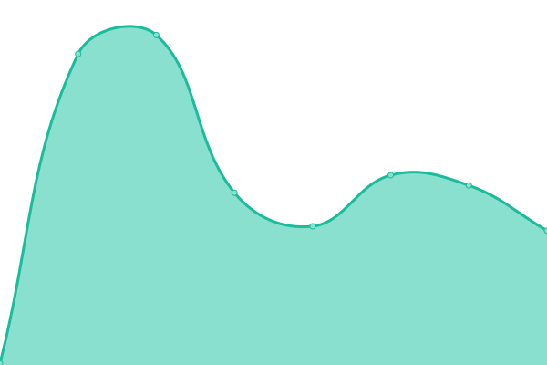
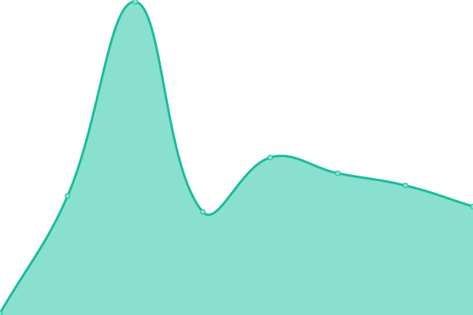

# [📈 Live Status](https://Hyperbolt.github.io/Upptime): <!--live status--> **🟧 Partial outage**

This repository contains the open-source uptime monitor and status page for [Hyperbolt](https://hyperbolt.xyz), powered by [Upptime](https://github.com/upptime/upptime).

With [Upptime](https://upptime.js.org), you can get your own unlimited and free uptime monitor and status page, powered entirely by a GitHub repository. We use [Issues](https://github.com/Hyperbolt/Upptime/issues) as incident reports, [Actions](https://github.com/Hyperbolt/Upptime/actions) as uptime monitors, and [Pages](https://Hyperbolt.github.io/Upptime) for the status page.

<!--start: status pages-->
<!-- This summary is generated by Upptime (https://github.com/upptime/upptime) -->
<!-- Do not edit this manually, your changes will be overwritten -->
<!-- prettier-ignore -->
| URL | Status | History | Response Time | Uptime |
| --- | ------ | ------- | ------------- | ------ |
|  [Website](https://hyperbolt.xyz) | 🟥 Down | [website.yml](https://github.com/Hyperbolt/Upptime/commits/HEAD/history/website.yml) | 

 0ms
     
 | 

<a href="https://Hyperbolt.github.io/Upptime/history/website">0.01%</a>
    

|  [API](https://gosogle.com) | 🟩 Up | [api.yml](https://github.com/Hyperbolt/Upptime/commits/HEAD/history/api.yml) | 

 440ms
     
 | 

<a href="https://Hyperbolt.github.io/Upptime/history/api">100.00%</a>
    

|  [Error Handler](https://gsoogle.com) | 🟩 Up | [error-handler.yml](https://github.com/Hyperbolt/Upptime/commits/HEAD/history/error-handler.yml) | 

 1721ms
     
 | 

<a href="https://Hyperbolt.github.io/Upptime/history/error-handler">99.87%</a>
    

|  [Logger](https://gsoogle.com) | 🟩 Up | [logger.yml](https://github.com/Hyperbolt/Upptime/commits/HEAD/history/logger.yml) | 

 629ms
     
 | 

<a href="https://Hyperbolt.github.io/Upptime/history/logger">100.00%</a>
    

|  [Discord Bot](https://gosogle.com) | 🟩 Up | [discord-bot.yml](https://github.com/Hyperbolt/Upptime/commits/HEAD/history/discord-bot.yml) | 

 353ms
     
 | 

<a href="https://Hyperbolt.github.io/Upptime/history/discord-bot">100.00%</a>
    

<!--end: status pages-->

[**Visit our status website →**](https://Hyperbolt.github.io/Upptime)

## 📄 License

- Powered by: [Upptime](https://github.com/upptime/upptime)
- Code: [MIT](./LICENSE) © [Hyperbolt](https://hyperbolt.xyz)
- Data in the `./history` directory: [Open Database License](https://opendatacommons.org/licenses/odbl/1-0/)
